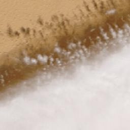

# Automated Wildfire Detection from NASA Satellite Imagery

## Project Overview

This project is an end-to-end machine learning pipeline that automatically detects wildfires from satellite imagery. It uses a Convolutional Neural Network (CNN) trained on publicly available data from NASA to identify fire and smoke patterns in satellite tiles of Northern Algeria.

The goal is to demonstrate a real-world application of computer vision for environmental monitoring and disaster response. The entire workflow, from data acquisition to prediction, is automated with Python scripts.

## Key Features

-   **Automated Data Acquisition:** Downloads satellite images and corresponding fire data directly from NASA's public APIs (GIBS and FIRMS).
-   **Data Processing:** Automatically labels and sorts images into `fire` and `no_fire` classes to create a custom dataset.
-   **Deep Learning Model:** Implements a CNN using TensorFlow and Keras to perform binary image classification.
-   **Visualization:** Generates a "before-and-after" GIF to clearly visualize the model's predictions on a test image.

## Technology Stack

-   **Language:** Python 3
-   **Core Libraries:**
    -   TensorFlow / Keras: For building and training the deep learning model.
    -   Pandas: For handling and processing the fire location data.
    -   Requests: For interacting with NASA's APIs.
    -   OpenCV-Python & Pillow: For image processing and manipulation.
    -   Imageio: For creating the output GIF.
    -   Matplotlib: For plotting the model's training history.

## Project Structure

asa_wildfire_algeria/
│
├── data/ # Folder for the image dataset (created automatically)
├── venv/ # Python virtual environment
│
├── download_data.py # Script 1: Downloads the image dataset
├── train_model.py # Script 2: Trains the machine learning model
├── predict.py # Script 3: Uses the model to create the final GIF
│
├── firms_data.csv # Input: Raw fire location data from NASA
├── requirements.txt # List of Python dependencies
│
├── wildfire_detector_algeria.keras # Output: The saved, trained model
├── training_history.png # Output: A chart of the model's performance
└── prediction_algeria.gif# Final Output: The animated GIF for showcasing

## How to Run This Project

### 1. Prerequisites

-   Python 3.8 or newer
-   Git (for cloning the repository)

### 2. Setup

First, clone the repository to your local machine:
git clone https://github.com/mathew-endreson/nasa_wildfire_algeria.git

cd nasa_wildfire_algeria

# Create the environment
python -m venv venv

# Activate on Windows
.\venv\Scripts\activate

# Activate on macOS/Linux
source venv/bin/activate

# Install the required libraries using the requirements.txt file:
pip install -r requirements.txt

# Get the Fire Data
Before running the scripts, you need to manually download the fire location data for the target region.
Go to the NASA FIRMS Archive Download page.
Select the Area (e.g., Northern Algeria) and Date Range (e.g., August 2021).
Download the CSV file.
Place the file in the root of the project directory and rename it to firms_data.csv.

# Running the Pipeline
Execute the scripts in the following order from your terminal:

Step 1: Download the Dataset
This script will read firms_data.csv and download hundreds of satellite images into the data/ folder.
python download_data.py

Step 2: Train the Model
This will train the CNN on the downloaded images and save the model as wildfire_detector_algeria.keras.
python train_model.py

Step 3: Generate a Prediction GIF
This will load the trained model, make a prediction on a random fire image, and save the result as prediction_algeria.gif.
python predict.py

You can run this script multiple times to see the model's performance on different images.

# This project was made possible by the publicly available data and services provided by NASA's Earth Science Data Systems.
Imagery courtesy of the NASA GIBS project.
Fire data courtesy of the NASA FIRMS project
